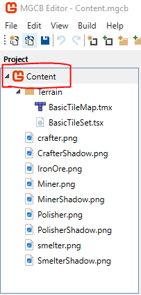
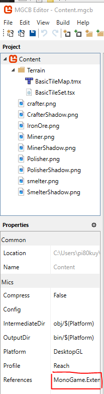
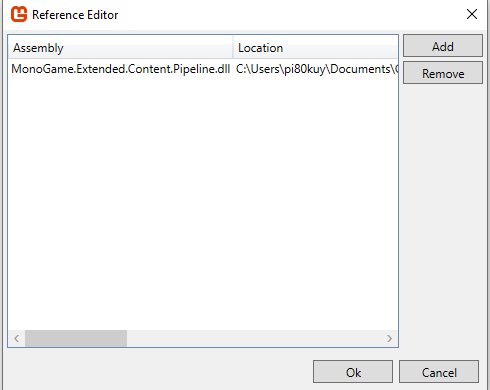

# FactorioLike-MAW2.1

Factorio like est un jeu 2D, primitif fait sur monogame à la façon factorio, on peut miner des minerais, fondre, polire et crafter avec ces dernier

## Language

C#

## Termes techniques

- Items : élement qui peux être transmis entre machines (example, un minerai)
Recettes : combinaisons D'items, qui permet de créer d'autre items.
- Craft : Action de transformer un item en un autre.
- Tile map : Collection de tiles qui crée une carte
- Tile set : Collection de tiles qui sont utilisée dans les tile maps
- MGCB : Outil de gestion du contenu du jeu

## Conventions de nommage

### Assets graphique / Sprites

dans ce projet, chaques sprites, qui peut être chargé dans le jeux sont nommé de cette manière :

Pour les machines de Craft : NomDeLaMachine+Type.png, le type represent quelle partie du sprite c'est, par example, les ombres, les highlights, etc, il sont dans des images differentes, mais represente le même object

Pour les minerais : TypeDeMetal+Ore.png, le type de métal, peux être par example, du fer, du cuivre, etc... "Ore", est fixe, il represent le type de métal c'est, example, on peut avoir IronBar.png, IronPlate.png, c'est bien de pouvoir faire la différence

## Technologie

- MonoGame(3.8.1)
- MonoGameExtended(3.9.0-alpha)
- MonoGameExtendedEntities(3.8.0)
- Dotnet(7.0)
- PlantUml

### paquets Alpha

- MonoGame.Extended
- MonoGame.Extended.Content.Pipeline
- MonoGame.Extended.Graphics
- MonoGame.Extended.Tiled

la version stable de MonoGame.Extended.Content.Pipeline, ne fonctionne pas avec MonoGame 3.8.0, il est impossible d'importer des tile maps et tile sets

Problèmes avec les version stables
- [Pull Request #735](https://github.com/craftworkgames/MonoGame.Extended/pull/735).
- [Issue #783](https://github.com/craftworkgames/MonoGame.Extended/issues/783).

Il était donc impératif d'utiliser une version alpha

### Fonctionnalitées

- 4 types machines (mineur, fondrie, polisseur, crafteur)
- Des mineraux (un au minimum)
- Transmission d'items en machines en machines
- Recettes simples (minerais fondu, minerais polis, plaque de métal)
- Placer les machines sur le terrain
- Terrain statique
- Movement du joueur (gauche, droite, bas, haut)

#### Si le temps le permets

- Génération du terrain procédurale
- Ennemis qui charge (Roaming)
- Inventaire du joueur

### Environment de travail

Visual studio community 2022

## Installation

allez sur ce site : https://visualstudio.microsoft.com/fr/vs/community/

et installez Visual studio community 2022

Après avoir l'avoire installé, allez sur ce site : https://monogame.net/articles/getting_started/1_setting_up_your_development_environment_windows.html et installez monogame

Vous êtes prêt pour participer au projet

### Content pipeline et Monogame extended

le manager de contenu (MGCB), permet d'ajouter des images, et autre choses, et permet de build afin de lancer le jeu.

Monogame extended tiled permet aussi d'ajouter des tile maps et tile sets, la gestion de tile maps et tile set avec le framework MonoGame çe fait avec l'ajout de MonoGame.Extended.Content.Pipeline dans MGCB.

#### Installation de Monogame extended content pipeline

assurez vous que le paquet Monogame.Extended.Content.Pipeline soit bien installé

Ensuite, ouvrez le gestionnaire de contenu "Content.mgcb", ensuite cliquez la racine nommée content

Ensuite, allez dans les Propriétées et ajoutez la réference à Monogame.Extended.Content.Pipeline, vous pouvez trouver le fichier .dll sous 

User\.nuget\packages\monogame.extended.content.pipeline\VersionDuPaquet\Tools\Monogame.Extended.Content.Pipeline.dll

Vous pouvez ensuite ajouter des tile maps et tile sets

##### Attention

soyez sure que dans les paramètres des objects que vous ajoutez, typiquement TileSets et TileMaps, de bien mettre le bon Importer et Processor

## Build

Pour build le jeu, il suffit de cliquer sur le bouton "Play"
